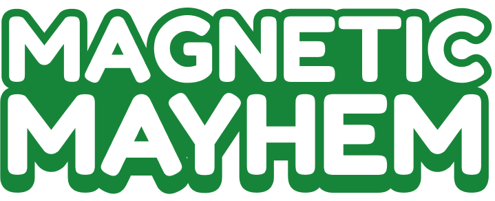
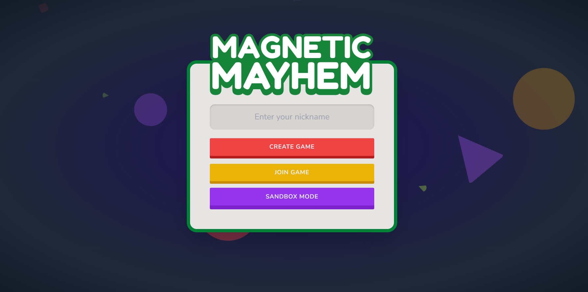
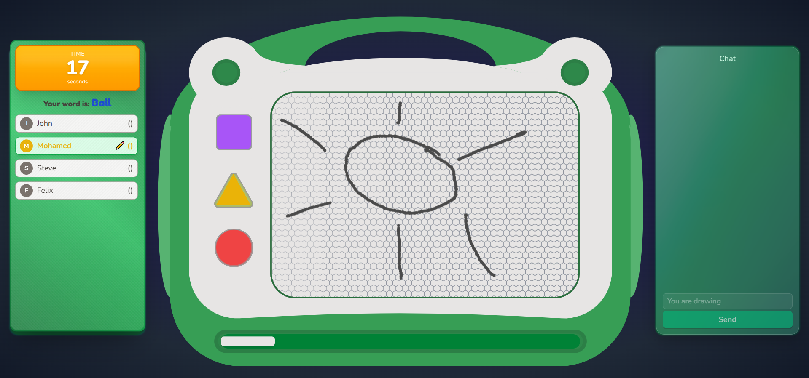

<div align="center">



**A real-time, nostalgic Pictionary-style game that reimagines classic drawing games with the charm of a children's magnetic drawing board.**

[](https://magnetic-mayhem-client.onrender.com)
[](https://github.com/AzzouzAimen/magnetic-mayhem)

</div>

---

## 📸 **Screenshots**

<div align="center">

### 🏠 **Homepage**


_Enter your nickname and choose your game mode_

### 🎮 **Game in Progress**


_Real-time drawing with the magnetic board interface_

</div>

---

## 🌟 **What is Magnetic Mayhem?**

Magnetic Mayhem is a web-based party game that brings friends together in private rooms to play a modern take on Pictionary. Players take turns drawing secret words on a nostalgic magnetic board while others guess in real-time. The game features a unique eraser slider that creates the authentic "magnetic board" experience with smooth wipe animations.

### ✨ **Key Features**

- 🎯 **Real-time Multiplayer** - Up to 8 players per room
- 🎨 **Magnetic Board Experience** - Authentic drawing board with hex pattern background
- 🧲 **Innovative Eraser Slider** - Smooth wipe animation that syncs across all players
- 🎵 **Immersive Sound Design** - Scratchy drawing sounds, satisfying stamps, and swoosh effects
- 🏆 **Scoring System** - Points for correct guesses and successful drawings

---

## 🎮 **How to Play**

### **Quick Start**

1. **Enter your nickname** on the homepage
2. **Create a game** or **join with a room code**
3. **Wait in the lobby** for other players to join
4. **Start drawing** when it's your turn (you'll see the secret word)
5. **Guess the drawings** when others are drawing
6. **Earn points** for correct guesses and successful drawings

### **Game Modes**

#### 🎯 **Multiplayer Mode**

- Create or join a private room with a 4-character code
- Take turns drawing and guessing
- Compete for the highest score
- Custom word lists and configurable round times

#### 🎨 **Solo Mode**

- Practice drawing with unlimited time
- Test out all the tools and features
- Perfect for getting familiar with the interface

---

## 🛠️ **Tech Stack**

### **Frontend**

- **React 19** - Modern React with latest features
- **Vite** - Lightning-fast build tool and dev server
- **Tailwind CSS** - Utility-first CSS framework
- **Socket.io Client** - Real-time communication
- **Canvas API** - Custom drawing implementation

### **Backend**

- **Node.js** - JavaScript runtime
- **Express.js** - Web application framework
- **Socket.io** - Real-time bidirectional communication

### **Deployment**

- **Docker** - Containerization
- **Render.com** - Cloud deployment platform

---

## 🎯 **Game Mechanics**

### **Scoring System**

- **Correct Guess**: +100 points
- **Successful Drawing**: +75 points (when someone guesses your drawing)
- **Round-based**: Points awarded at the end of each round

### **Game Flow**

1. **Lobby Phase** - Players join and wait for game start
2. **Drawing Phase** - One player draws, others guess (60 seconds)
3. **Results Phase** - Show correct word and update scores
4. **Next Round** - Automatically proceed to next drawer
5. **Game End** - Final scoreboard and play again option

### **Room Management**

- **4-character codes** - Easy to share with friends
- **Private rooms** - Only players with the code can join
- **Host controls** - Room creator can start games and configure settings
- **Auto-cleanup** - Empty rooms are automatically removed

---

## 🚀 **Quick Start**

### **Local Development**

```bash
# Clone the repository
git clone https://github.com/AzzouzAimen/magnetic-mayhem.git
cd magnetic-mayhem

# Start with Docker (recommended)
docker-compose up --build

# Or start manually
cd server && npm install && npm run dev
cd client && npm install && npm run dev
```

### **Access the Application**

- **Client**: http://localhost:5173
- **Server**: http://localhost:4001

---

<div align="center">

**⭐ Star this repository if you enjoyed the project!**

</div>
